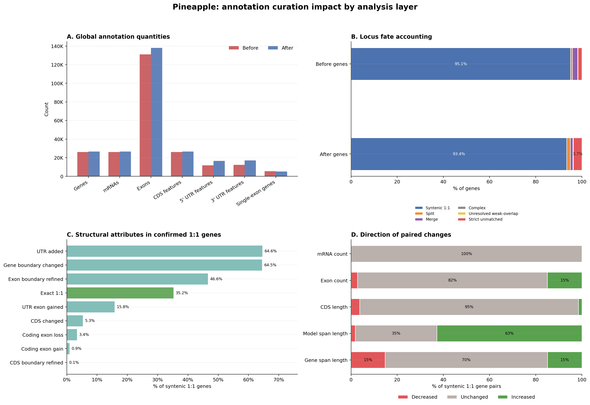
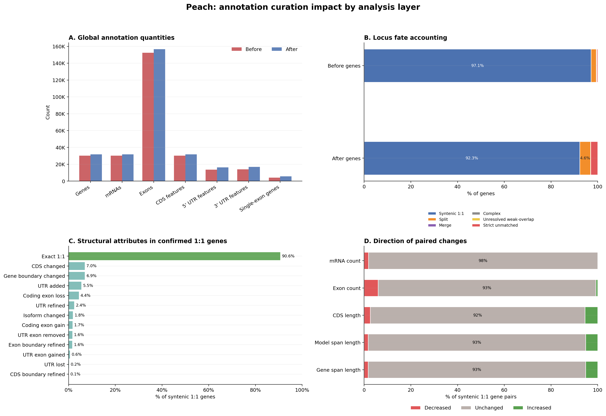
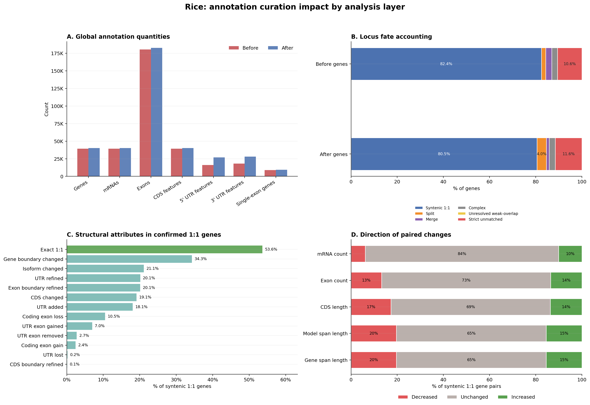

# Annotation Curation Comparison Analysis

This directory compares gene structure annotations before and after manual
curation for the configured species in `species.json`.

The GitHub repository is intended to contain the analysis code, tests,
documentation, lightweight summary tables, and publication figures. Large raw
FASTA/GFF/GTF inputs and large per-gene logs are intentionally excluded by
`.gitignore`.

## ABCD Evaluation Examples

The single-species ABCD figure is the main visual summary for checking one
species before and after manual curation:

- **A. Quantity changes**: global annotation counts, including genes, transcripts,
  exons, and CDS features.
- **B. Locus fate**: before/after gene accounting after reciprocal-overlap locus
  matching, including confirmed 1:1 pairs, split/merged loci, unresolved weak
  overlaps, and strict unmatched before/after genes.
- **C. 1:1 structural attributes**: structural changes among genes with confirmed
  before/after one-to-one correspondence.
- **D. Paired change magnitude**: per-pair delta distributions for gene span,
  transcript count, exon count, and CDS length.

### Pineapple



### Peach



### Rice



Additional species figures:
[Artemisia annua](figures/Artemisia_annua_ABCD_single_species.png),
[Cucumber](figures/Cucumber_ABCD_single_species.png),
[Fragaria ananassa](figures/Fragaria_ananassa_ABCD_single_species.png), and
[Fragaria vesca](figures/Fragaria_vesca_ABCD_single_species.png).

## Inputs

Each species is expected to have one `before` and one `after` annotation file in
the analysis directory:

```text
<species_id>.before.gff
<species_id>.before.gff3
<species_id>.after.gff
<species_id>.after.gff3
```

Compressed `.gff.gz` and `.gff3.gz` files are also supported by the Python
parsers. Derived files such as `.tmap` and `.refmap` are ignored when resolving
primary annotations.

Raw input files are not committed to GitHub. To reproduce the analysis, either
place the input annotations in the project directory using the names above, or
set `ANALYSIS_DIR=/path/to/data` before running the commands below.

## Environment

Install the locked environment with:

```bash
pixi install
```

The main dependencies are Python, pandas, numpy, matplotlib, seaborn, AGAT,
gffcompare, and bedtools.

## Reproducible Workflow

Run the external comparison tools:

```bash
pixi run analyze
```

Build summary tables:

```bash
pixi run summarize
```

Run coordinate-based locus comparisons:

```bash
pixi run locus
```

The default locus scope is `mrna`, which excludes gene features without an
`mRNA` or `transcript` child. Transcripts must also contain an explicit `exon`
or `CDS` feature in the input GFF; mRNA-only or UTR-only records are filtered
before overlap matching because their raw spans cannot define reliable loci.
The default overlap mode is `hybrid`: candidate gene pairs are scored by the
best before/after transcript pair, using exon-footprint overlap defined as
`overlap / min(tx_length_before, tx_length_after)`, where `tx_length` is the
summed length of merged exons in one transcript. Complete or high-confidence
containment is therefore treated as strong locus evidence without letting all
isoforms of a gene inflate the denominator. The overlap graph also prunes weak
bridge edges when two independent strong one-to-one anchors already explain the
locus. Use `--overlap-mode reciprocal` or `--overlap-mode containment` only for
sensitivity checks or legacy comparisons.

Generate final locus summary tables and figures:

```bash
pixi run tables
pixi run figures
pixi run target-figures
```

Generate A/B/C/D single-species summary tables and a four-panel figure:

```bash
python plot_single_species_abcd.py --species Pineapple
```

Export IGV-friendly event tracks from the locus change logs:

```bash
pixi run tracks
```

The track exporter reads `results/locus/<species_id>_change_log.csv` and writes
event-level BED, GFF3, and TSV review files under `results/tracks/`. Load the
BED track together with the before/after GFF3 annotations in IGV to inspect
whether each predicted locus or structural-change event is reasonable.

Single-species IGV track example:

```bash
python export_change_tracks.py --species Pineapple
```

Concrete single-species example using Pineapple:

```bash
# Rebuild the Pineapple ABCD tables and figure from existing summary/locus outputs.
python plot_single_species_abcd.py --species Pineapple

# Main figure:
ls figures/Pineapple_ABCD_single_species.png

# Supporting tables:
ls results/single_species/Pineapple_ABCD_tables.md
ls results/single_species/Pineapple_figureA_quantity_table.csv
ls results/single_species/Pineapple_figureB_locus_fate_table.csv
ls results/single_species/Pineapple_figureC_syntenic_structure_table.csv
ls results/single_species/Pineapple_figureD_pair_delta_summary.csv
```

Regenerate all tracked single-species ABCD figures:

```bash
for sp in Artemisia_annua Cucumber Fragaria_ananassa Fragaria_vesca Peach Pineapple Rice; do
  python plot_single_species_abcd.py --species "$sp"
done
```

For table and figure regeneration from existing AGAT/gffcompare/locus outputs:

```bash
pixi run report
```

Run the complete workflow, including external tools and locus comparisons:

```bash
pixi run full
```

Validate cross-table consistency:

```bash
pixi run validate
```

## Outputs

- `stats/`: AGAT per-annotation statistics, generated locally and not tracked.
- `compare/`: AGAT before/after comparison reports, generated locally and not tracked.
- `tcompare/`: gffcompare outputs, generated locally and not tracked.
- `results/`: aggregate CSV/TSV tables and locus comparison logs.
- `figures/`: generated publication figures.
- `logs/`: full command logs from `run_analyses.sh`.

Important result tables:

- `summary_stats.csv`: coding-section AGAT statistics used by plots.
- `summary_stats_by_section.csv`: long-form AGAT statistics preserving all sections.
- `comparison_matrix.csv`: AGAT mRNA/transcript-scope comparison using `gene@mrna@cds`, `gene@mrna@exon`, `gene@transcript@cds`, and `gene@transcript@exon`.
- `comparison_by_feature_path.csv`: AGAT comparison split by every feature path table.
- `comparison_matrix_all_gene_types.csv`: broad AGAT comparison across all feature paths.
- `locus_comparison_summary.csv`: mutually exclusive locus subtype summary; one syntenic gene contributes to one broad category.
- `locus_comparison_multilabel.csv`: non-exclusive locus subtype attributes; one syntenic gene can count in multiple columns.
- `curation_core_metrics.csv`: compact per-species table for the publication figure. The main metrics are no-overlap new/deleted loci, split/merge events, and the fraction of before/after genes whose strict 1:1 representative transcript has an exon change; representative-transcript union and CDS subcounts are retained as audit columns.
- `locus_diagnostics.csv`: overlap-mode diagnostics, including candidate pairs and weak bridge edges pruned between strong one-to-one anchors.
- `validation_report.csv` / `.md`: consistency checks across summary, compare, and locus outputs.

Large per-gene files such as `results/locus/*_change_log.csv` and
`results/single_species/*_syntenic_pair_deltas.csv` are generated locally but
excluded from GitHub. The tracked `*_change_summary.csv`, A/B/C/D summary
tables, and figures are sufficient for quick review.

Primary figures:

- `figure1_quantity_changes.png`: before/after quantity changes, including gene counts.
- `figure2_syntenic_structure_changes.png`: non-exclusive structural attributes for confirmed one-to-one gene pairs.
- `curation_core_metrics_publication.png`: three-panel cross-species summary of locus gain/loss, split/merge events, and representative-transcript exon changes as fractions of before/after annotations.
- `{Species}_ABCD_single_species.png`: per-species four-panel summary covering global quantities, locus fate, 1:1 structural attributes, and paired change magnitude.

Documentation:

- `docs/locus_compare_calculation_and_results.html`: compact calculation summary, latest results, and IGV validation notes.
- `docs/locus_compare_algorithm.html`: full locus-comparison algorithm notes.
- `docs/curation_core_metrics_figure_algorithm.html`: focused explanation of the current A/B/C core figure.

## Java implementation

A JDK 11 / NetBeans Ant reimplementation lives in `java-locus-compare/`.
Generated Java outputs are excluded from GitHub; regenerate and validate them
locally with:

```bash
cd java-locus-compare
ant test
ant run-all
ant validate-python-parity
```

## Configuration

- Edit `species.json` to add, remove, or reorder species.
- Set `ANALYSIS_DIR=/path/to/analysis` or pass `--analysis-dir DIR` to run
  against another directory.
- Pass one or more species IDs to process a subset:

```bash
bash run_analyses.sh Rice Peach
python run_locus_comparisons.py Rice Peach
```

## Validation

Run the lightweight parser tests:

```bash
pixi run test
```

The key consistency expectation is that all configured species appear in
`summary_stats.csv`, `comparison_matrix.csv`, `accuracy_metrics.csv`, locus
summary tables, and the generated figures.
